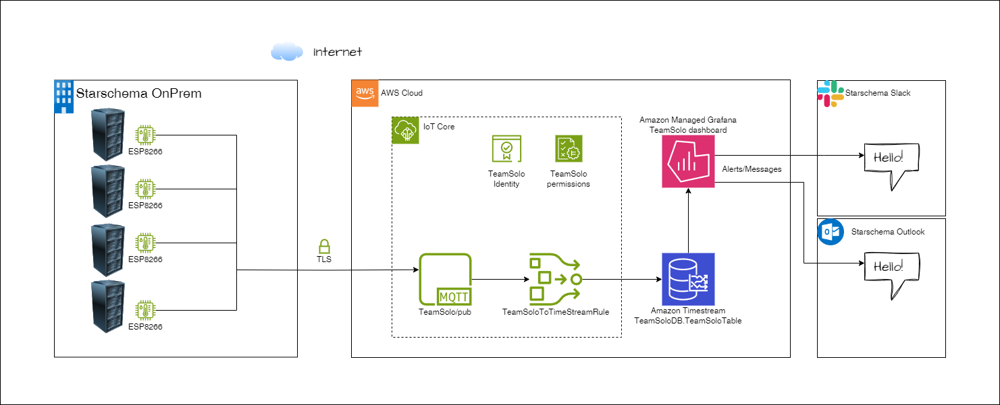

# IoT Sensor Data to AWS

### Check out my other repo, where I work on implementing this in Docker and Minikube.
### [https://github.com/balazsmolnar87/iot-minikube](https://github.com/balazsmolnar87/iot-minikube)

This project demonstrates how to send IoT sensor data to AWS IoT Core, store it in Amazon Timestream, and visualize it using Amazon Managed Grafana. The application captures data from multiple IoT devices, processes it through AWS IoT services, and provides a user-friendly dashboard for monitoring. Additionally, the system sends alerts and notifications to Slack and email, ensuring prompt communication about critical events.

More info: [https://balazsmolnar87.github.io/prod-hackathon-server-room/](https://balazsmolnar87.github.io/prod-hackathon-server-room/)

## Purpose
The objective of this project is to develop an efficient solution for monitoring and reporting the temperature and humidity levels in server rooms. The system incorporates several key features to maintain optimal conditions and ensure smooth operations:

1. **Frontend Interface**: Provides real-time data, making it easy for administrators to monitor the server room conditions and history.
2. **Threshold Alerts**: Allows setting threshold levels for temperature and humidity. Automatic alerts are triggered if these levels are breached.
3. **Slack and Email Notifications**: Sends immediate notifications via Slack and email to inform the team about potential issues for timely action.
4. **Fail Notification**: Alerts the system if any device is not reporting.

## Features
- **IoT Data Capture**: Collects data from IoT sensors every 5 seconds.
- **AWS IoT Core Integration**: Handles secure data transmission and processing.
- **Time-Series Storage**: Utilizes Amazon Timestream for efficient data storage and querying.
- **Data Backup**: Archives older data to Amazon S3.
- **Visualization**: Presents data using Amazon Managed Grafana for easy analysis.
- **Frontend Interface**: Provides real-time data, making it easy for administrators to monitor server room conditions and history.
- **Threshold Alerts**: Allows setting threshold levels for temperature and humidity. Automatic alerts are triggered if these levels are breached.
- **Slack and Email Notifications**: Sends immediate notifications via Slack and email to inform the team about potential issues for timely action.
- **Fail Notification**: Alerts the system if any device is not reporting.

## Architecture

## Usage
1. Deploy the necessary AWS services (IoT Core, Timestream, S3, Managed Grafana).
2. Configure IoT devices to send data to AWS IoT Core.
3. Set up Grafana to connect with Timestream for data visualization.
4. Configure threshold alerts and notifications (Slack and email).

## Prerequisites
- AWS Account
- Basic knowledge of AWS services
- IoT Devices
- Access to Wifi and the internet

## Setup Instructions
1. Clone the repository.
2. Deploy the AWS infrastructure as defined in the project.
3. Configure your IoT devices to send data to AWS IoT Core.
4. Set up threshold alerts and configure Slack and email notifications.
5. Connect Amazon Managed Grafana to Timestream for data visualization.

## License
This project is licensed under the MIT License.
